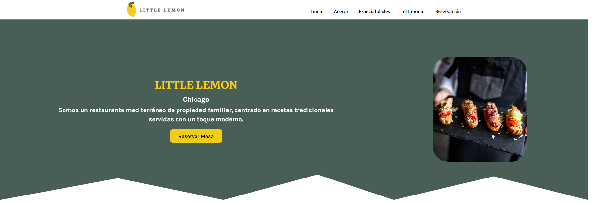

<!--
 
   Configuracion de Vitest Y Testing Library para realizar pruebas unitarias:
 
  1. Instalar Vitest: 
    
      npm install -D vitest
  

  2. En el package.json agregar:
   {
    "scripts": {
      "test": "vitest"
    }
   }


   3. crear un archivo prueba Random.Test.ts (Puede ser cualquier nombre) y colocar:

      import { describe, it, expect } from 'vitest';

      describe('basic arithmetic checks', () => {
        it('1 + 1 equals 2', () => {
          expect(1 + 1).toBe(2);
        });

        it('2 * 2 equals 4', () => {
          expect(2 * 2).toBe(4);
        });
      });

    
    3.1 Ejecutar: npm run test

     Si todo es correcto, su prueba debería pasar. No debería ver ningún error en su terminal, y todo debería estar en verde 😀.


   
   4. instalar Testing Library y jsdom:

      npm install --save-dev @testing-library/react @testing-library/dom @types/react @types/react-dom 
                @testing-library/jest-dom @testing-library/user-event jsdom    


    5. En mi caso no realice la configuracion en vite.config.ts debido a un error en Typescript y algunas dependencias,
       mi solucion fue crear un archivo en la raiz vitest.confing.ts copiar el siguiente codigo:

       /vitest.confing.ts:

       import { defineConfig, mergeConfig } from 'vitest/config'
       import viteConfig from './vite.config.ts'

      export default mergeConfig(viteConfig, defineConfig({
        test: {
          globals: true,
          environment: 'jsdom',
          setupFiles: './src/vitest.setup.ts',
        },
      }))
    


     6. Crear un archivo en el directorio src/vite.setup.ts y agregar el siguiente codigo:

        src/vitest.setup.ts:

        import { expect, afterEach } from 'vitest';
        import { cleanup } from '@testing-library/react';
        import * as matchers from '@testing-library/jest-dom/matchers';

        expect.extend(matchers);

        afterEach(() => {
          cleanup();
        });


    7. También necesitamos agregar el siguiente código a nuestro archivo tsconfig.app.json, lo que nos permite usar las funciones globales de Vitest como describe, it y expect sin necesidad de importarlas explícitamente. 

       tsconfig.app.json:

       {
          "compilerOptions": {
            "types": ["vitest/globals", "@testing-library/jest-dom"]
          }
        }


      8. Probando nuestros componente en react.

      8.1 Creando un componente random para realizar las pruebas:

      src/Components/RandomTest/RandomTest.tsx:

        const Random = () => {
          return <div>Random Component</div>;
        };
        export default Random; 


       8.2 Creando el archivo para realizar las pruebas unitaria del componente:

       src/Components/RandomTest/Random.test.tsx:  

        import { describe, it, expect } from 'vitest'
        import { render, screen } from '@testing-library/react'
        import RandomTest from './RandomTest'

        describe('Random Component', () => {
          it('renders correctly', () => {
            render(<RandomTest/>)
            screen.debug() // Logs the DclearOM structure
            const element = screen.getByText('Random Component')
            expect(element).toBeInTheDocument()
          })
        })


       8.3 Ejecutar npm run test 


       9. (Opcional) Instalar la version vites ui para visualizar todos los test

        npm i -D @vitest/ui

       9.1. Modificar el package.json y agregar el flag --ui: 
              
               vitest --ui

      Asi:

        package.json:

        "scripts": {
          "test": "vitest --ui"
        }


        9.2. Ejecutar: 
            
              npm test 
        
        Se abrira una pagina web con todos los tests


 Fuentes: https://johnsmilga.com/articles/2024/10/15
          https://github.com/john-smilga/vite-ts-vitest-react-testing-library-template
 */             

                    
-->


# Little Limon Restaurant
Bienvenido al repositorio del sitio web de Little Lemon Restaurant. Este proyecto se creó como parte del curso Meta Frontend Developer. Está construido con React y ofrece una interfaz elegante para los usuarios que desean explorar el menú del restaurante y hacer reservas.





## Vista previa en producción

¡Echa un vistazo a la versión en vivo del sitio web!  [Ver demostración en vivo](https://little-lemon-restaurant-kappa.vercel.app/).


## Features

- Navegación fluida a través de las páginas.
- Explora el menú del restaurante con estilo.
- Haga una reserva utilizando un formulario interactivo.
- Construido con React para una experiencia de usuario moderna e interactiva.

## Tecnologías Implementadas

Este proyecto está construido utilizando las siguientes tecnologías:

- **Vite**: Herramienta de construcción rápida para aplicaciones web, utilizada para optimizar el proceso de desarrollo y mejorar la experiencia en la construcción del proyecto.
- **TypeScript**: Superset de JavaScript que agrega tipado estático, mejorando la calidad del código y la experiencia de desarrollo.
- **React**: Biblioteca de JavaScript para la construcción de interfaces de usuario, utilizada para crear componentes reutilizables y estructurar la aplicación.
- **Vitest**: Framework de pruebas unitarias y de integración para aplicaciones de JavaScript, diseñado para ser rápido y compatible con Vite.
- **Testing Library**: Conjunto de herramientas para realizar pruebas de componentes de React, enfocado en pruebas basadas en la interacción del usuario.


## Instalación 

1. Clona el repositorio:
   ```bash
   git clone carloszuniga777/Little-Lemon-Restaurant
   ```
2. Instala las dependencias:
 
 ``` 
    npm install
 ```
## Ejecutar localmente

Ejecutar el proyecto localmente:
```bash
npm run dev
```
Ejecutar los test:

```bash
npm test
```

Se abrira una ventana automaticamente en el navegador donde se veran todos los test

## Contribuciones

Las contribuciones son bienvenidas. Si deseas mejorar este proyecto, por favor crea un fork del repositorio y envía un pull request.
